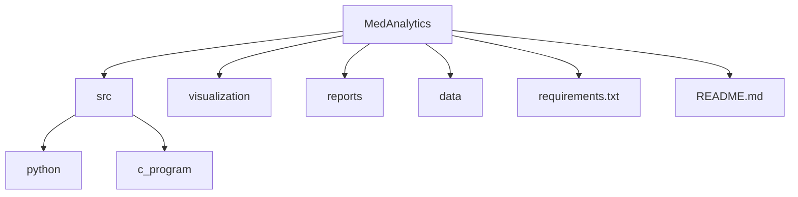

# MedAnalytics - Healthcare Data Analysis System
## Video Demo: https://www.youtube.com/watch?v=S-QVXALr7Kw
## Description
MedAnalytics - The Healthcare Data Analysis System is a project designed to analyze healthcare data, detect anomalies, and forecast patient health trends. The system leverages Python for high-level data processing and visualization, while C is utilized for low-level computations and anomaly detection. A graphical user interface (GUI) is built using Tkinter, making it user-friendly.

## Table of Contents
- [Overview](#overview)
- [Table of Contents](#table-of-contents)
- [Features](#features)
- [Tools Used](#tools-used)
- [Project Structure](#project-structure)
- [Getting Started](#getting-started)
  - [Installation](#installation)
  - [Setting Up the Environment](#setting-up-the-environment)
- [Usage](#usage)
- [Code Walkthrough](#code-walkthrough)
  - [Python Code](#python-code)
  - [C Code](#c-code)
- [Data Format](#data-format)
- [Forecasting](#forecasting)
- [Future Enhancements](#future-enhancements)

## Features
- Upload and process healthcare data from CSV files.
- Calculate average values for heart rate, blood glucose, and temperature.
- Detect anomalies in health parameters.
- Visualize health trends over time using Matplotlib.
- Forecast patient health trends using linear regression.

## Tools Used
- **Python**: For data processing and visualization.
- **C**: For low-level computations and anomaly detection.
- **Tkinter**: For creating the graphical user interface.
- **Pandas**: For data manipulation and analysis.
- **Matplotlib**: For plotting visualizations.
- **Scikit-learn**: For implementing the forecasting model.

## Project Structure


## Getting Started

### Installation
1. Ensure you have Python installed. You can download it from [python.org](https://www.python.org/downloads/).
2. Install required Python libraries:
   ```bash
   pip install pandas matplotlib scikit-learn
   ```
3. For C, ensure you have a compiler installed (e.g., GCC).

### Setting Up the Environment
- Optionally, create a virtual environment for the project:
   ```bash
   python -m venv venv
   source venv/bin/activate  # On Windows use: venv\Scripts\activate
   ```

## Usage
1. Place your healthcare data CSV files in the `data/` directory.
2. Run the Python application:
   ```bash
   python src/python/main.py
   ```
3. Use the GUI to open a CSV file for analysis. The application will calculate averages, detect anomalies, and generate visualizations.

## Code Walkthrough

### Python Code
- The Python script (`main.py`) handles file operations, data processing, anomaly detection, and visualization.
- The GUI allows users to interact with the application easily.

### C Code
- The C program (`analysis_program.c`) is responsible for detecting anomalies in heart rate, glucose, temperature, and blood pressure based on standard health thresholds.

## Data Format
The expected format for the CSV file is as follows:
```csv
id,heart_rate,blood_glucose,temperature,blood_pressure
1,72,90,98.6,120/80
2,55,130,100.5,125/85
3,85,110,99.1,130/85
...
```
- **Columns**:
  - `heart_rate`: Patient's heart rate in beats per minute (bpm).
  - `blood_glucose`: Blood glucose level in mg/dL.
  - `temperature`: Body temperature in °F.
  - `blood_pressure`: Blood pressure in mmHg (formatted as systolic/diastolic).

## Forecasting
The system includes a simple linear regression model to forecast heart rate trends based on historical data. The model predicts future values and visualizes them in a plot.

## Future Enhancements
- Integrate live health data from wearable devices.
- Expand the forecasting model to include more health parameters.
- Improve the GUI for better user experience.
- Implement machine learning models for more advanced health predictions.
